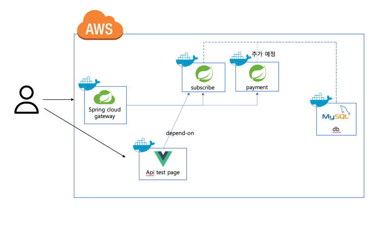

# Subscri: 종합 구독 & 결제 플랫폼 (토이 프로젝트)

Subscribe에 오신 것을 환영합니다. 이 플랫폼은 모든 규모의 사업체를 위해 구독 관리를 간소화하고 결제 과정을 효율화하도록 설계된 종합적인 솔루션입니다. 
다양한 비즈니스 파트너와 긴밀히 협력하여 고객에게 개인화된 구독 옵션과 효율적인 결제 솔루션을 제공합니다.

우리의 플랫폼은 Software as a Service (SaaS) 모델로 운영되어 벤더와 고객 모두를 대상으로 견고한 구독 관리 및 결제 솔루션을 제공합니다. 
Subscribe를 통해 사업체는 자체 구독 서비스를 효과적으로 관리하고 운영할 수 있습니다.
## 아키텍처 설계

(api test page를 gateway에 추가할지 고려중입니다.)

## DB Table Diagram

## 어려웠던 부분과 해결방안

### 1. 구독 서비스의 다양한 옵션 처리

**어려웠던 부분:**
- 도전: 여러 구독 옵션 처리와 중복 구독 허용의 복잡성 및 확장성문제.
  
**해결 전략:**
- 복잡한 구독 옵션 로직을 개선하기 위해 두 가지 디자인 패턴을 결합하여 적용하였습니다.

**전략 패턴(Strategy Pattern):**
- 전략 패턴(Strategy Pattern): 구독 옵션 처리 방식을 정의하고 선택할 수 있는 여러 전략 클래스를 구현하였습니다. 이를 통해 다양한 구독 옵션 로직을 분리하고 교체 가능하게 만들었습니다.

**데코레이터 패턴(Decorator Pattern):**
- 데코레이터 패턴(Decorator Pattern): 추가적인 옵션 기능을 동적으로 부여하기 위해 데코레이터 패턴을 활용하였습니다. 데코레이터 클래스들을 통해 기본 구독 로직에 부가 기능을 더함으로써 코드의 재사용성과 확장성을 향상시켰습니다.

**결과:**
- 결과: 구독 옵션 처리 로직을 모듈화하여 유지보수성과 코드 확장성을 개선했습니다. 각 구독 옵션을 독립적으로 관리하며, 새로운 옵션 추가나 기존 옵션 수정이 용이한 유연한 시스템을 구축했습니다.

### 1. Security 로그인 처리시 redirect 문제

**어려웠던 부분:**
- 도전: Spring Security를 이용한 로그인/로그아웃 시 Gateway를 벗어나 서비스로 리다이렉트되는 문제.

**해결 전략:**
- 해결: 임시로 spring security에서 defaultSuccessUrl을 gateway로 이동하도록 설정하였습니다. 시간이 허락하면 gateway에서 security를 관리하고 서비스로 사용자 정보를 전달하는 방식으로 변경할 예정입니다.
